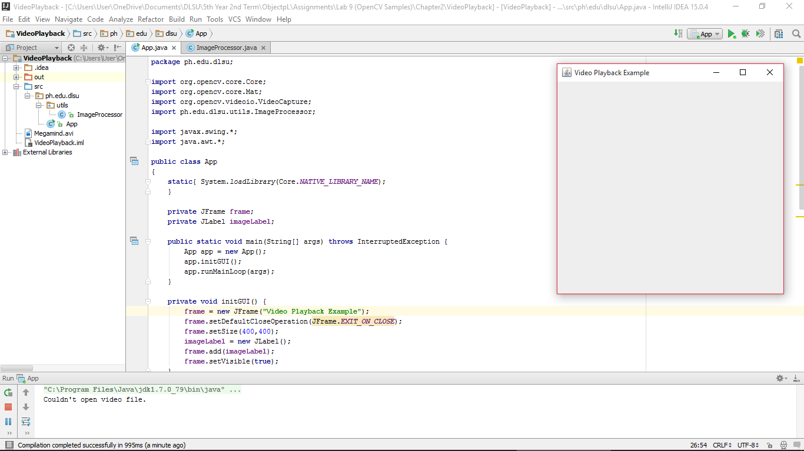

#VideoPlayback

Learning to play the recorded video file. But error keeps on occuring saying that it cannot open the video file.

#ScreenShot

#Code

###App
~~~
package ph.edu.dlsu;

import org.opencv.core.Core;
import org.opencv.core.Mat;
import org.opencv.videoio.VideoCapture;
import ph.edu.dlsu.utils.ImageProcessor;

import javax.swing.*;
import java.awt.*;

public class App
{
    static{ System.loadLibrary(Core.NATIVE_LIBRARY_NAME);
    }

    private JFrame frame;
    private JLabel imageLabel;

    public static void main(String[] args) throws InterruptedException {
        App app = new App();
        app.initGUI();
        app.runMainLoop(args);
    }

    private void initGUI() {
        frame = new JFrame("Video Playback Example");
        frame.setDefaultCloseOperation(JFrame.EXIT_ON_CLOSE);
        frame.setSize(400,400);
        imageLabel = new JLabel();
        frame.add(imageLabel);
        frame.setVisible(true);
    }

    private void runMainLoop(String[] args) throws InterruptedException {
        ImageProcessor imageProcessor = new ImageProcessor();
        Mat webcamMatImage = new Mat();
        Image tempImage;
        VideoCapture capture = new VideoCapture("C:\\Users\\User\\OneDrive\\Documents\\DLSU\\5th Year 2nd Term\\" +
                "ObjectpL\\Assignments\\Lab 9 (OpenCV Samples)\\Chapter2\\VideoPlayback\\Megamind.avi");
        if( capture.isOpened()){
            while (true){
                capture.read(webcamMatImage);
                if( !webcamMatImage.empty() ){
                    tempImage= imageProcessor.toBufferedImage(webcamMatImage);
                    ImageIcon imageIcon = new ImageIcon(tempImage, "Video playback");
                    imageLabel.setIcon(imageIcon);
                    frame.pack();  //this will resize the window to fit the image
                    Thread.sleep(50);
                }
                else{
                    System.out.println(" Frame not captured or video has finished");
                    break;
                }
            }
        }
        else{
            System.out.println("Couldn't open video file.");
        }

    }
}
~~~

###ImageProcessor
~~~
package ph.edu.dlsu.utils;

import org.opencv.core.Mat;
//import java.awt.Image;
import java.awt.image.BufferedImage;
import java.awt.image.DataBufferByte;

public class ImageProcessor {

    public BufferedImage toBufferedImage(Mat matrix){
        int type = BufferedImage.TYPE_BYTE_GRAY;
        if ( matrix.channels() > 1 ) {
            type = BufferedImage.TYPE_3BYTE_BGR;
        }
        int bufferSize = matrix.channels()*matrix.cols()*matrix.rows();
        byte [] buffer = new byte[bufferSize];
        matrix.get(0,0,buffer); // get all the pixels
        BufferedImage image = new BufferedImage(matrix.cols(),matrix.rows(), type);
        final byte[] targetPixels = ((DataBufferByte) image.getRaster().getDataBuffer()).getData();
        System.arraycopy(buffer, 0, targetPixels, 0, buffer.length);
        return image;
    }

}
~~~
